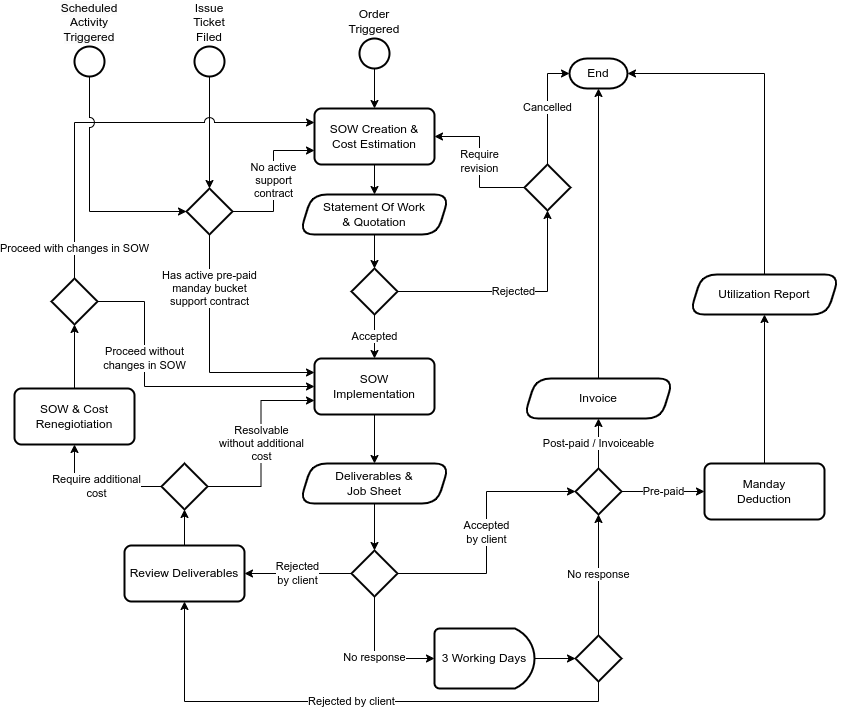

This Terms of Service (including any Exhibits) governs your use of the Professional Services and is subject to the General Terms of Engagement available at  or, as applicable, other base agreement between you (Client) and ${PROVIDER} (Provider). In the event of a conflict between this Terms of Service and the base agreement, the terms of this Terms of Service control.

The Provider may modify this Terms of Service by posting a revised version at ${AGREEMENT_URL}, or by providing notice using other reasonable means.

Unless set forth otherwise in the applicable Statement of Work (“SOW”), the following terms shall apply to Professional Services ("Services"):

1. **Provider as the Client’s Professional Services Subcontractor.** If the Client is a prime contractor and Provider is acting as the Client’s subcontractor (a “Subcontracting Engagement”), then these Terms of Service, the applicable SOW, and the Agreement shall apply between the Client and the Provider with respect to the Provider’s provision of the Professional Services. The Provider shall provide the Professional Services for the Subcontracting Engagement to the Client for the Client’s end customer project. Any agreement entered into between the Client and its end customer is solely between the Client and such end customer.

2. **Service Engagement Process.** Client agree that the following process shall apply for the engagement of Professional Services.

   a) Unless mutually agreed upon, requests for services engagement should be made in writing to Provider in not less than five (5) working days prior to commencement of Services.

      i) Services engagement with Service Level Agreement (“SLA”) shorter than five (5) working days shall be pre-paid as Consulting Unit bucket and consumed by drawing down the bucket.

      ii) A minimum draw-down of 0.1 Consulting Unit will be charged daily as standby fee for services with SLA that requires outside of working hours response time, and 0.2 Consulting Unit shall be charged daily for services with SLA that requires 24/7 response time.

   b) Provider should create a SOW, and estimate the contract price required to render the service in the form of Quotation and submit them for acceptance by Client. Client should assist Provider by promptly providing all information requests required for the creation of the SOW. Unless otherwise agreed upon in writing,

      i) a single SOW shall be limited to Deliverables that can be completed within a four (4) weeks cycle or less. Activities that would require more than four (4) weeks to deliver shall be split into multiple SOW to be delivered consecutively.

      ii) SOW Service fees should be priced as fixed fee, or based on Consulting Unit estimation utilizing rates agreed upon between Client and Provider in a Schedule Of Services ("Estimated SOW Price").

      iii) if SOW Services is based on Consulting Unit estimation, at completion of a cycle, Provider shall calculate the fees based on the actual Consulting Unit spent to deliver the SOW ("Effective SOW Price"). In the event of the Effective SOW Price is less than Estimated SOW Price, the effective billable fees for the SOW ("Final SOW Contract Price") shall be:

            EC = Effective SOW Cost

            OC = Estimated SOW Cost

            Final SOW Contract Price = EC + (20% x (OC - EC))

      In the event of the Effective SOW Price is higher than the Estimated SOW Price, the Final SOW Contract Price shall be the same as the Estimated SOW Price.

      iv) before the commencement of subsequent cycle, Provider and Client have an option to review the subsequent related SOW and Provider have an option to re-estimate the SOW contract price. Client upon mutual agreement in writing of Client and Provider, may choose to proceed with the revised SOW and Quotation or terminate the engagement.

   c) Unless mutually agreed upon in writing, following rules shall apply:

      i) Professional Services shall not cover the service to design, develop, nor conduct training activities.

      ii) Professional Services shall not cover the service to design, develop, nor conduct transfer of knowledge activities.

      iii) Training and transfer of knowledge activities are subject to Training Services Terms of Service.

   d) Work shall only commence after the acceptance of the SOW and Quotation by Client.

   e) Upon completion and delivery of the Deliverables, Client shall be given three (3) business days ("Acceptance Period") to verify the Deliverables for completeness or defects and notify the Provider in written for resolution. If there are no written notification after the Acceptance Period, the Deliverables shall be automatically considered as accepted and related payments would be due.

3. **Consulting Unit.** Each Consulting Unit shall be up to a maximum of eight (8) hours and utilization of a Consultant for any hours within a day shall constitute a single Consulting Unit. Unless mutually agreed upon or stated otherwise in the applicable SOW, Services shall be engaged in accordance to following rules:

   a) Client agrees to engage a Consultant for a minimum of five (5) consecutive business days.

   b) Following activities shall be considered as utilization of Consultant:

      i) Attendance to a meeting with Client, Client employee(s) or Client representative(s) for purpose(s) related to the delivery of the SOW.

      ii) Responding to support tickets raised by Client.

      iii) On-premise or remote activity or activities related to the delivery of the SOW.

      iv) Travel to Client premise(s) or other premise(s) for purpose(s) related to the delivery of the SOW.

   c) Utilization in excess of eight (8) hours in a single day on weekdays shall be constituted as two (2) Consulting Unit utilization.

   d) Utilization less than four (4) hours outside of business hours on weekdays shall be constituted as one-and-half (1.5) Consulting Unit utilization.

   e) Utilization during weekends and public holidays shall be constituted as two (2) Consulting Unit utilization.

   f) Utilization in excess of eight (8) hours in a single day on weekends and public holidays shall be constituted as three (3) Consulting Unit utilization.

   g) Time spent on traveling to Client premise shall be added into utilized hours.

   h) Phone or on-line consulting shall be considered as an engagement and be calculated into utilized hours.

4. **Provider Responsibilities.**

   a) Provider should provide a single point of contact to Client for the duration of the project for coordination and scheduling of project tasks, documentation and any changes to scope requiring a Change Order.

   b) Provider should coordinate activities of all Provider resources and provide consultants with the requisite skills necessary to properly execute the requirements of the SOW.

   c) Provider should communicate status and changes to status to Client before and during the engagement.

5. **Client Responsibilities.**

   a) Client shall be responsible for fully describing business requirements and their respective acceptance criteria to Provider including completing any questionnaires from Provider, along with current business processes and data processing overview.

   b) Client should assign a Project Manager who will:

      i) be available to Provider personnel throughout the engagement;

      ii) coordinate all interviews and meeting schedules with the Client team.

   c) Client shall assign managers, full-time system administrators and other personnel, as appropriate, to work with Provider throughout the project duration. Client shall make a knowledgeable representative available to Provider during all phases of the engagement and shall engage and participate throughout the project duration. In particular, Client shall work collaboratively with Provider to address any issues with Provider's environment in a timely manner.

   d) Client shall purchase or provide all hardware, software, licenses, staff,  maintenance contracts, public internet protocol ("IP") addresses, encryption keys and system environments necessary for Provider to provide the Services.

   e) Client shall provide Provider personnel with access to Client's building facilities, computer room facilities, systems, passwords, etc., as needed, during normal business hours as well as after hours, if necessary, and a suitable work area commensurate with the number of on-premise Provider consultants.

6. **Mobilization Fee.** Unless mutually agreed upon, upon acceptance of the applicable SOW, an initial payment (the "Mobilization Fee") of fifteen percent (15%) of the total value of the SOW shall be due to Provider. Upon payment of the Mobilization Fee, Provider shall establish communication channels for coordinating the delivery of Services specified in the applicable SOW.

7. **Engagement Management**. Unless mutually agreed upon, Client shall engage a minimum of one (1) Consulting Unit of Engagement Manager day for every five (5) Consulting Unit of Consultant for the purpose of engagement management.

8. **Travel Expenses.** Client shall pay travel and other expenses incurred by Provider in performing the Services. In the event of Client requested the engagement to be canceled or rescheduled within thirty (30) days prior to the start date of the SOW ("Scheduled Date"), Client shall reimburse Provider for any non-refundable travel expenses that were booked prior to Provider’s receipt of Client’s request to cancel or reschedule. In the event of Client requested the engagement to be canceled or rescheduled within fourteen (14) or fewer days prior to the Scheduled Date:

   a) Client shall reimburse Provider for any non-refundable travel expenses that were booked prior to Provider’s receipt of Client’s request to cancel or reschedule; and

   b) Provider shall be entitled to invoice and Client agrees to pay a reschedule fee of MYR 10,000 which shall be in addition to the fees set forth in the SOW.

9. **Change Control Process.** If either party wishes to make changes to the SOW, including but not limited to modifying the scope of work or the fees, such changes shall only be effective upon mutual agreement and execution of a “Change Order” describing such changes.  Provider shall have no obligation to provide Services pursuant to a Change Order unless both parties have executed a Change Order.

10. **Documentation.** Provider shall submit all final Project documentation(s) in Portable Document Format ("PDF"), or if applicable, in printed form. Provider reserve the rights to use any software and tools to create documents and document elements. Document(s) in its source format should be provided upon request, however, Provider is under no obligation to provide to Client the software, training, nor knowledge needed to open or compile the source format, neither responsible for any issues arise due to Client failure to use compatible software to open or to apply the steps required compile the source format.

11. **Documentation Change Request.** Project documentations will be created following standard best practice of Provider. Revision to follow a different documentation practice may be subject to additional costs. . Any revision to follow a different documentation practice requested by the Client shall be considered a change request. The Client agrees that such changes may incur additional costs, and payment for these changes shall be made in accordance with the Provider’s standard billing rates or as otherwise mutually agreed in writing prior to implementation.

12. **Training and Knowledge Transfer.** Unless mutually agreed upon or stated otherwise in the applicable SOW, Provider is under no obligation to provide training nor knowledge transfer related to the technologies, tools, methodology, skills nor knowledge that was utilized to deliver the Services.

13. **Escalation Process.** In the event of issue in the engagement, and the issue is not being resolved in a reasonable time frame, Provider or Client may escalate the issue as follows:

    a) Raise the issue initially to the Engagement Manager.

    b) If not resolved at the Engagement Manager level, an issue report shall be generated and the issue shall be escalated to the Client-nominated sponsor.

    c) If the issue cannot be resolved within a predetermined period or falls outside the authority of the sponsor, it shall be escalated to Provider's Senior Management.

14. **Fixed Fee Services.** For Services to be performed on a fixed fee basis, Client is responsible to ensure that all requirements are spelled out in detail and signed-off in a Requirement Document. Provider shall review the signed-off Requirement Document and advise Client on the Requirement Item that able to be delivered, and what unable to be delivered within the scope, timeline and budget of the SOW. Client and Provider shall agree in writing on which Requirement Items that shall be delivered within the scope, timeline and budget of the SOW prior to commencement of work. Client agree to execute a Change Order for Requirement Items that could not be delivered within the scope, timeline and budget of the SOW.

15. **Acceptance Process.** For Services performed on a time and materials basis, Provider deliverables to Client shall only be the utilized Consulting Unit and shall be deemed accepted upon delivery. Utilized Consulting Unit shall be invoiced monthly based on actual Consulting Unit utilized. Provider shall use commercially reasonable efforts to complete Services described in the SOW but does not guarantee such Services shall be completed within the allotted hours or days set forth in the SOW.  If additional Consulting Unit are required, the parties must mutually approve and execute a Change Order.
   
    For Services performed on a fixed fee basis to include documentation deliverables or other deliverables (the “Deliverables”), Provider shall notify Client upon delivery of the Deliverables and Client shall have three (3) business days to review such Deliverables (the "Acceptance Period") to confirm that the Deliverables conform to any acceptance criteria as may be set forth in the SOW.  Within the Acceptance Period, Client must provide to Provider in writing its acceptance of the Deliverables or a notification of any issues or deficiencies.  In the event of notification of any issues or deficiencies, Provider may, in its sole discretion, either promptly revise the Deliverables and resubmit them for Client review, or if such revision and re-submission is not reasonably practicable, as Client’s sole remedy and Provider’s exclusive obligation, Provider shall undo, retract, or remove artifacts created as part of the non-confirming Deliverable, refund any pre-paid fees for the non-conforming Deliverable, the SOW shall terminate and no further fees shall be due under the SOW.  If Client fails to provide Provider written notice of either acceptance or notification of issues or deficiencies within the Acceptance Period, the Deliverable(s) shall be deemed accepted and any related payments shall become due.

\newpage

## Service Engagement Process

Following flow chart describe the detail of Professional Services Engagement Process.

{width=100%}
